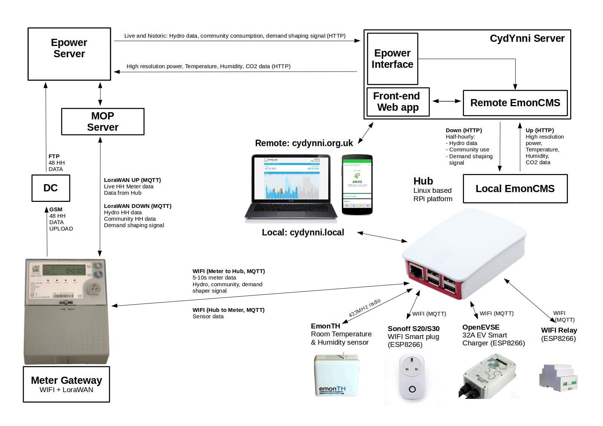
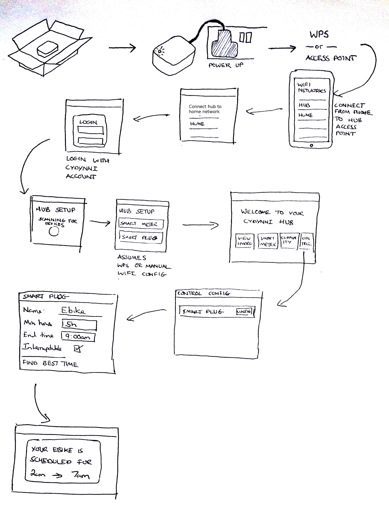

# CydYnni Hub and wider system architecture

*Trystan Lea, Megni | OpenEnergyMonitor : August 2017*

The outlined CydYnni system below provides:

- Close to real-time billing grade meter reading
- Hydro and community demand aggregation
- Smart device control in the home for automated demand response
- Mobile, tablet, laptop user interface as an in home display both for reporting and control setup.

### System diagram

**Household billing meter and meter gateway**

On the left we start with the household billing meter and Energy Assets meter gateway which provides near real-time meter reading both of half hourly energy consumption and 5-10s real power measurement.

The meter gateway is based on the ESP8266 WIFI platform and provides a user interface for initial configuration including: connecting to the household WIFI network and detection of the in home hub.

Meter readings are passed to the hub over WIFI using the MQTT protocol, this route is protected with TLS.

The meter gateway is also connected to a LoraWAN network ran by EnergyAssets which provides a secure upload route for half hourly meter readings and a potential route for data upload of other sensor data in the home.

The LoraWAN network also provides the default route for the download of aggregated community consumption data, hydro generation data and the demand shaping signal. Which are then pushed on to the home hub over MQTT for use in the in-home-display and for deciding the best time to run the control devices.

**Hub**

The in home hub is responsible for both managing the control of smart devices in the home and making high resolution near real-time sensor data available for the in-home-display (mobile/tablet/laptop) user interface.

The hub is based on the OpenEnergyMonitor emonbase/EmonPi software stack which is designed for the RaspberryPi hardware platform. Most of the software stack is portable to other linux boards/systems e.g beaglebone.

The core of the stack is EmonCMS (Our open source data storage, manipulation and visualisation software). This provides sensor and control device support, Auto-configuration of sensors and local storage of sensor data. EmonCMS interfaces with a MQTT broker installed on the hub to which the meter gateway and the WIFI based control devices connect.

The local version of the CydYnni app sits on top of EmonCMS providing a tailored user interface for the CydYnni project, accessible from: cydynni.local

The hub can download historic hydro, community and household account data from the CydYnni server when it is provisioned – where this data has been recorded via the meter gateway → lorawan → epower data route.

The meter gateway connects to a MQTT broker running on the hub and publishes 5-10s periodic meter readings for display in the in-home app served from the hub. The meter gateway also provides the hub with daily updates of hydro, community and demand shaper signal data.

**CydYnni Server**

The CydYnni server hosts the web accessible CydYnni app at cydynni.org.uk. The server is a Linux VPS running a LAMP stack, python, redis, mosquitto MQTT broker and LetsEncrypt for TLS. Installed on top of these basic requirements is the CydYnni App and Emoncms providing the data backend.

The CydYnni server fetches half-hourly hydro, community and household half hourly data as well as daily and monthly summaries from the E-power server HTTP API. Scheduled scripts on the CydYnni server update a local cache of this data on the CydYnni server to both enable greater functionality and provide faster app loading times for participants.

## Hub software implementation

The user interface for the software on the CydYnni Home Hub is a web application that runs on the home hub providing CydYnni dashboard access and smart appliance control within the home, configurable from any smart phone or computer’s internet browser.

The CydYnni front-end app is combined with the emoncms data backend to deliver the requirement for storage and visualisation of smart meter data and state control of smart plugs/devices.

The CydYnni app shares many of the requirements provided for by the OpenEnergyMonitor Emoncms application including user authentication, data storage, data visualisation & MQTT integration. 

The CydYnni hub app requires a more user-friendly interface without many of the advanced features available in Emoncms but it still shares these core features making it possible to build on top of Emoncms for faster, more efficient development and accessibility to wider Emoncms features when needed.

### Client and server code

A modern web application consists of two key parts the client side code (html, css, JavaScript) and the server side code (e.g: php, python). The client side code is rendered and ran by the user’s internet browser. The server side code runs on the hub itself and is responsible for loading the initial web application page to the client and then handling subsequent client AJAX data requests to a HTTP API.

Smart meters, smart plugs and other devices interface directly with the server either by posting data to a HTTP API, requesting data from a HTTP API or publishing and subscribing to MQTT.

### Model-view-controller design pattern

The CydYnni front-end app follows a front controller and model-view-controller design pattern. A front controller is where all HTTP traffic is directed through a single entry point. This is a common design pattern which allows for the loading of components used by the whole application such as user sessions and database connection in one place.

**Model:** A model in the CydYnni app is a class with properties and methods that defines and implements a data model, in most cases a model’s methods include an element of input sanitation, data validation, processing, storage and error reporting. A good way to think of the model is as a software library that can be included in an application. An example of a model in the cydynni hub application is the user model which handles user authentication, profile information and forgotten passwords.

Methods such as:

    $user->login($username,$password);
    $user->register($username,$password,$email);
    $user->set_email($id,$email);

are accessible from the front or sub-controllers providing a useful level of abstraction keeping code clean and modular.

**Views:** The client side application scripts to generate the user interface and handle data on the client (i.e HTML, CSS, Javascript)

**Controllers:** The controller links the view to the model translating a HTTP request to an API into a model method call. For example:

    /app/user/login?user=example&password=example

is converted into the method call

    $user->login($username,$password);

The controller also handles access control. Certain model methods should only be able to be ran if a user has the permission to do so.

### Data storage

In order to ensure long service life from Hub SD cards a mixture of approaches are recommended as employed on OpenEnergyMonitor raspberrypi based hardware running emoncms.

1. The operating system is ran on a read-only partition on the SD card and a separate writeable partition is created specifically for files that need to be written to / changed. This ensures that there is tight control of what writes to the SD card avoiding the risk of some part of the system unknowingly using up the available SD card write lifespan.

2. Any temporary data that is regularly updated such as the last power value from a smart meter is stored in an in-memory database so that these regular data updates do not result in SD card disk writes. We use a redis key-value store for this in emoncms.

3. Persistent data such as user profile information and device configuration is stored in a MYSQL database.

4.  Time-series data: In order to reduce SD card write load on particular SD card cells time-series data can be written in append mode only while also buffered and then written in a block update. It is also possible to optimise data query time and storage size with a fixed interval time-series format.

**Fixed interval time-series: (From our emoncms documentation)**

In many if not most applications time series data is recorded at a fixed interval. A temperature or power measurement is made every 10 seconds, minute or hour. Given this highly regular nature of the time series data we can do away with the need to record every data point’s timestamp and instead just record the start time of the time series and the time series interval in a meta file and then only record the datapoint values in the datafile. The timestamp for any given datapoint can easily be worked out by the start time, interval and the position of the data point in the file.

There are two main advantage of this approach versus the variable interval approach:

1. The first advantage is that if we want to read a datapoint at a given time we don’t need to search for the datapoint as we can calculate its position in the file directly. This reduces the amount of reads required to fetch a datapoint from up to 30 reads down to 1 giving a significant performance improvement.

2. The second advantage is that in a time series where the data is highly reliable the disk use can be up to half that of the disk use used by a variable interval engine, due to not needing to record a timestamp for each datapoint. 

As part of the OpenEnergyMonitor project we have developed an open source time-series data storage engine that implements the above features called PHPFina which is used on the CydYnni Hub.

### Hub MQTT Broker

MQTT is a publish-subscribe based “lightweight” messaging protocol that runs on top of the TCP/IP protocol. Is is increasingly being used in the IOT field for communication between smart devices. Sensor nodes can publish to a MQTT topic which the Hub can then subscribe to and handle accordingly. Likewise control nodes can subscribe to a topic on a Hub that provides a control signal.

The CydYnni Hub has a MQTT broker installed to which devices in the home can connect to and then subscribe or publish messages. MQTT provides a lighter-weight alternative to using HTTP and removes the requirement for sensor nodes or control nodes to poll a central server periodically as messages can be pushed from the server/hub to connect devices via their ongoing open connection.

### Over the air updates

The CydYnni hub will extend the existing emonSD OTA update implementation but with the option to trigger an update remotely. The current OTA emonSD process consists of a user triggered background script that runs through a controlled update and upgrade process.

### WIFI Device pairing implementation

The WIFI Device pairing mechanism for the SonOff smart plug, WIFI Relay and OpenEVSE charging station works as follows:

1. WIFI device broadcasts a WIFI access point to which the user can connect to from their phone/laptop. 
2. Once connected via the access point, the user selects their home WIFI network and enters the passkey to connect to their home WIFI network.
3. The hub provides a known hostname to which the WIFI device attempts to connect e.g: cydynni.local. In the event that this method fails the hub also broadcasts a periodic UDP broadcast which the device can use to find the IP-address of the hub.
4. The WIFI device then sends an authentication request to a special HTTP API on the hub.
5. The Hub displays a popup notification in the households device list asking the user to confirm that the requesting device is allowed access.
6. The hub then provides one time IP-address limited access to the MQTT authentication details of the local MQTT broker.
7. The WIFI device saves these details, which it then uses to connect to the hub.

### CydYnni hub control implementation

See: [Emoncms: Demand Shaper module](http://github.com/emoncms/demandshaper)

The intention is to make it possible for a user to login to the CydYnni app, select a device from the device list such as a Smart Plug or OpenEVSE charger and set a ‘schedule’ for that device which would consist of the time for the device to be ready, the period for which to run and whether the device is interruptible or not. An example could be charging an electric bike or car battery where the end time is 8 am, period is 5 hours and interruptibility is fine.

The scheduler would also have the option to configure the repetition of a schedule, e.g: every weekday, only on Wednesdays or weekends. Similar to how alarms are set using the Android alarm app.

Once a schedule has been set the hub then selects the best time to run the device/appliance based on the demand shaper profile received from the smart meter gateway. An updated profile will be available in the evening of the day before at which point schedules for the day ahead will be calculated.

These schedules are translated into device setting parameters. A device such as a smart plug or OpenEVSE charge controller connected to the hub subscribes to the relevant MQTT topic containing its name, changes to the device parameters are published by the hub and received by the connected device.

Overview of the user journey for configuring a smart plug control device:

### Core hardware and software stack requirements

- RaspberryPI or similar low power linux computer with ability to install linux operating system such as raspbian linux and have access to the full software stack. 
- USB sockets for interface extension, e.g: Z-wave USB dongle.
- WIFI connectivity
- Ethernet connectivity
- Full sudoer SSH access to linux OS.
- SD card data logging, read only OS partition and writeable carefully controlled data partition, append only time series data storage, use of in memory (RAM) database for state machine etc to reduce write load on SD card.

### Application software stack requirements

- Apache, MYSQL, PHP server
- PHP & Python server side application code support
- Html, css & JavaScript client side (available in the internet browser)
- Mosquitto MQTT server
