# EnergyLocal Hub & Smart Plug Setup Guide

## 1. Connect

### Option 1: Ethernet Setup

If you have the option to connect your hub directly via Ethernet this is usually easier and more reliable than using WIFI, alternatively if you wish to setup using the WIFI hotspot, skip this section and continue to WIFI Setup below.

Plug in an Ethernet cable to link your hub to your internet router and then power up the hub by connecting the micro USB cable and USB power supply.

### Option 2: WIFI Setup

#### a. Power up the CydYnni hub

After a short while a WIFI Access Point should appear called 'EmonPi'. Connect to this network, open an internet browser and enter the following address:

    http://192.168.42.1

#### b. Connect to WIFI network

Once the page at the address above loads it will give the following options, or if the hub is connected with an ethernet cable there will also be the option to connect over ethernet.

Select 'Connect to WIFI network' to connect to your home WIFI network.
    
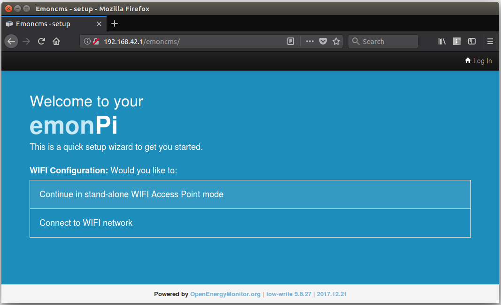

The hub will now show a list of available WIFI networks, select the WIFI network you wish to connect to:

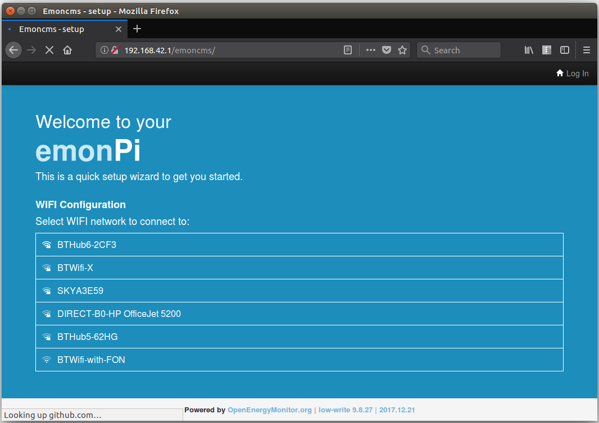

Enter the WIFI network passkey if applicable:

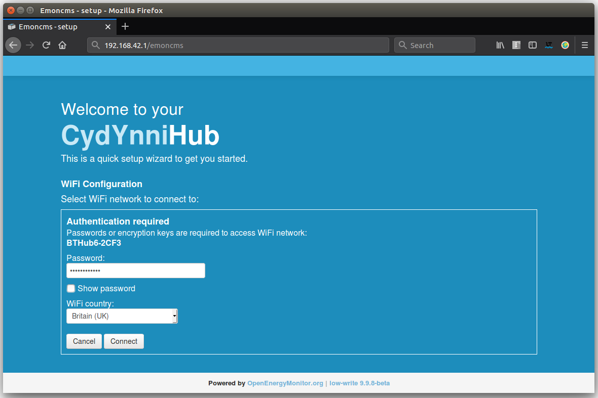

After clicking connect the following message is shown. Your hub is now rebooting and will then attempt to connect to the network selected.

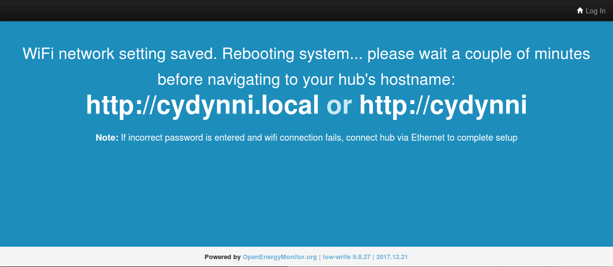

Switch back to your home network. Try connecting to your hub via it's hostname. Try the following links:

- [http://emonpi](http://emonpi)
- [http://emonpi.lan](http://emonpi.lan)
- [http://emonpi.local](http://emonpi.local)

If these links do not work try the following device provisioning steps.

## 2. Hub provisioning

1. Login to your online Energy Local dashboard: [http://dashboard.energylocal.org.uk/?household](http://dashboard.energylocal.org.uk/?household)

2. Navigate to 'My Account' (top-right hand corner of the window).

3. In the 'Find my Hub' section. Enter the 8 character hub code printed on the top of the hub and click 'Find':

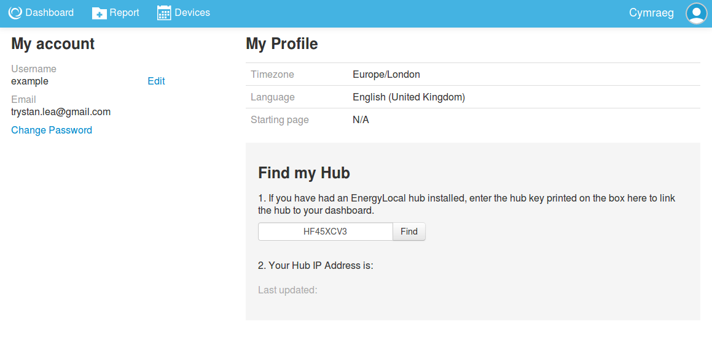

4. If the hub is connected to your local network and has been turned on for about 60s, the hub's IP address should now show: 

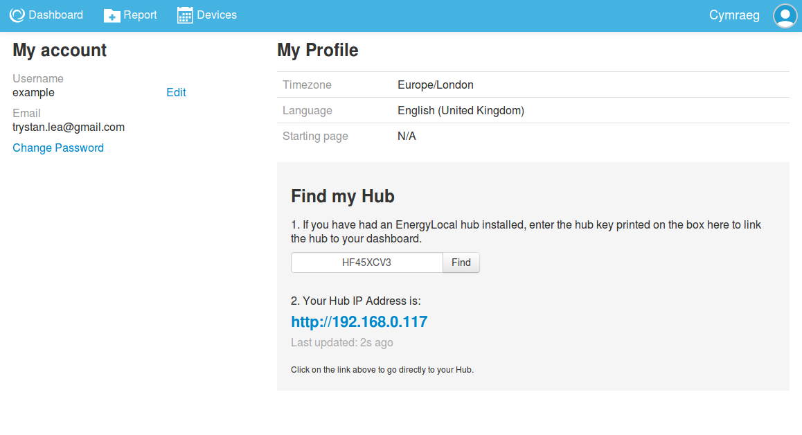

5. Click on the IP address link to navigate to your hub.

## 3. Login to the Hub with your EnergyLocal online account

Click on the My Score tab and enter your energy local online account details. The login process take about 5 seconds - during which your hub is linked to your online account. 

## 4. Explore your hub dashboard

The first page that you see when you login shows your household electricity consumption overview.

**Tip:** Hover over a bar in the bargraph to see the cost and consumption breakdown in the pie chart below the bar graph.

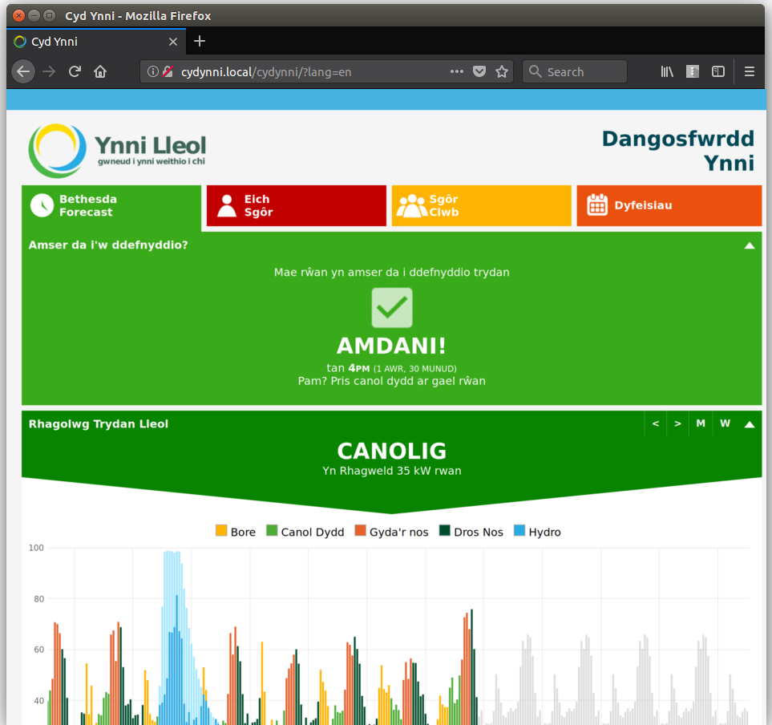

The CydYnni forecast page shows when it's a good time to use electricity or not and the recent history of club consumption and generator output.

The Club page shows the club score and overview.

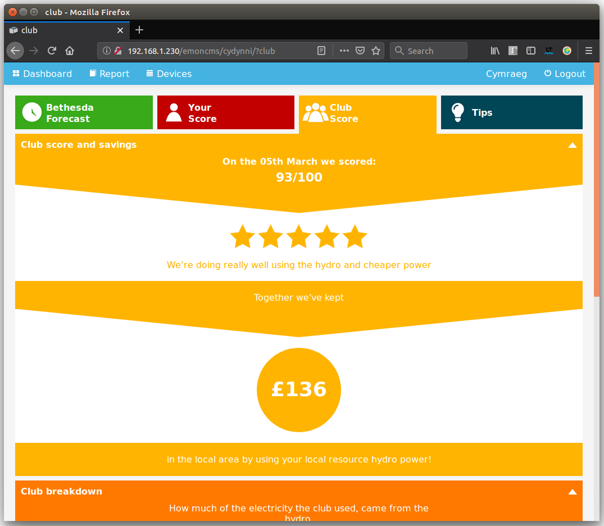

The 4rth tab shows tips on energy saving and moving power to lower cost times.

## 5. Setting up your WiFi Smart Plug

The Smart Plug will allow you to schedule whatever is plugged into it to come on and go off for periods of time that you set and is connected to the Forecast facility. This allows you to automatically use electricity at the best times.

1\. Plug your smart plug into an electrical socket. The light on the plug will show green for 3 seconds followed by a short off period and then a couple of very short flashes. This indicates that the plug is working and has created a WIFI Access Point.

2\. The WIFI Access Point should appear in your laptop or phones available WIFI networks, the SSID will contain the name smartplug followed by a number e.g: 'smartplug1'.

3\. Connect to this network, open an internet browser and enter the following address:

**[http://192.168.4.1](http://192.168.4.1)**
    

4\. Select the WIFI network you wish to connect to, enter the passkey and click connect. 

The green light on the smartplug will now turn on again. If the connection is successful you will see 10 very fast consecutive flashes. 

5\. The web interface will also show that the module has connected and its IP address:

**Failed Connection**

If the smartplug fails to connect to the selected WIFI network the green LED will stay on with a slight pulsing rythym for 30 seconds before the plug automatically resets and tries again. To re-enter setup mode hold the button on the front of the smartplug down while the green LED is on.

## 6. Device pairing on the hub

With the smartplug WIFI settings configured connect back to you home network and navigate to the devices page on the hub:

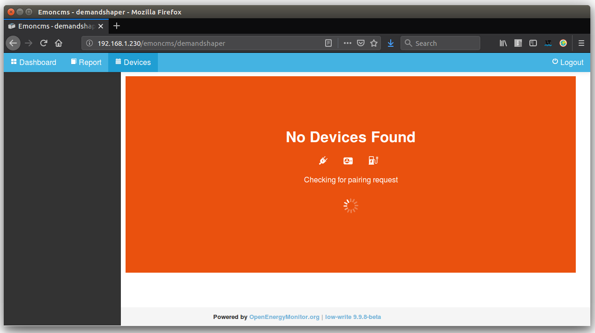

After a couple of minutes a notice will appear asking whether to allow device at the given ip address to connect:

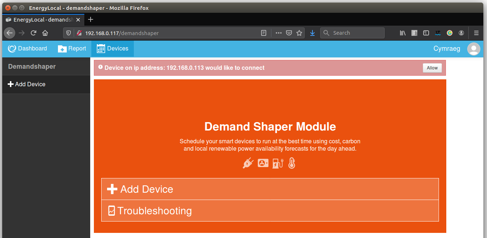

Click allow and wait a couple of minutes for the device to appear.

## 7. Scheduling the Smart Plug

Try adjusting the schedule using the run period, complete by and ok to interrupt settings:

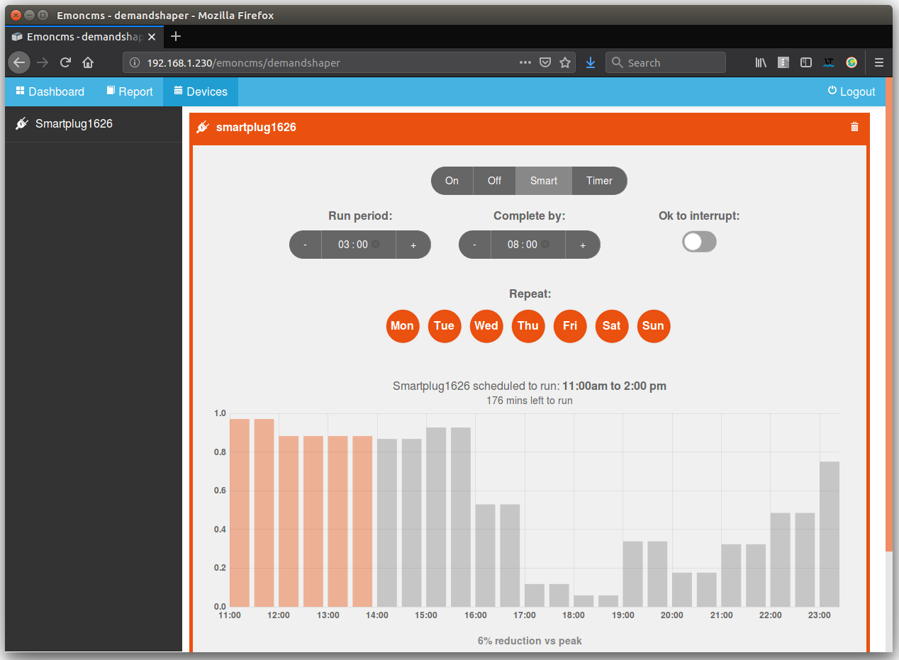

or/and turn the smartplug on and off directly by clicking on the on/off buttons:

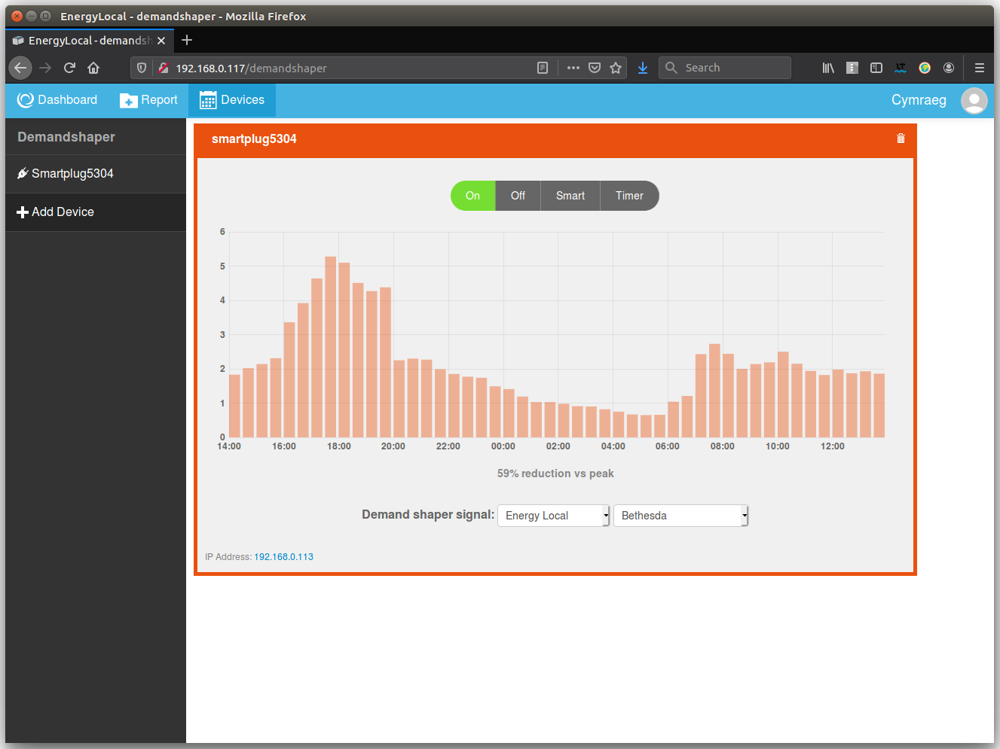 

**Tip:** The smartplug can be turned on and off at the plug as well by clicking the push button on the front of the smartplug. Refresh the page to see changes in the dashboard.

---

### Alternative hub detection method

Navigate to the 'Find Devices' tool on the EnergyLocal App:

#### [https://dashboard.energylocal.org.uk/find](https://dashboard.energylocal.org.uk/find)

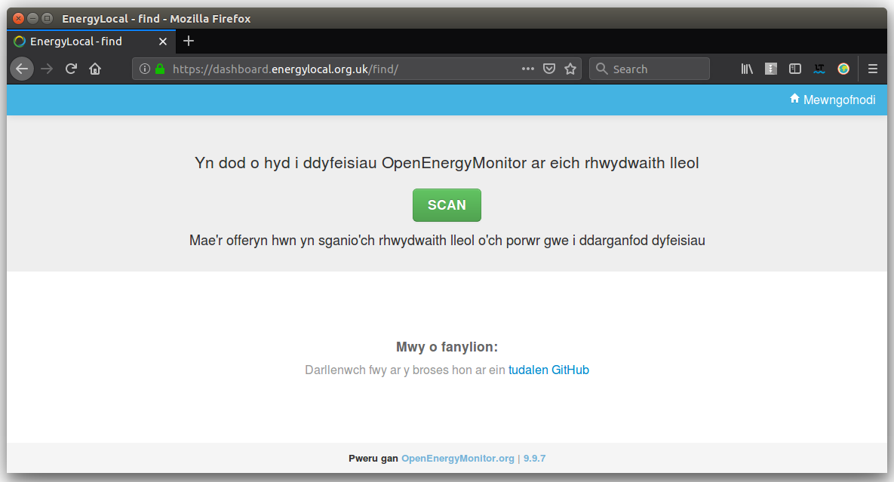

Click SCAN to find your hub:

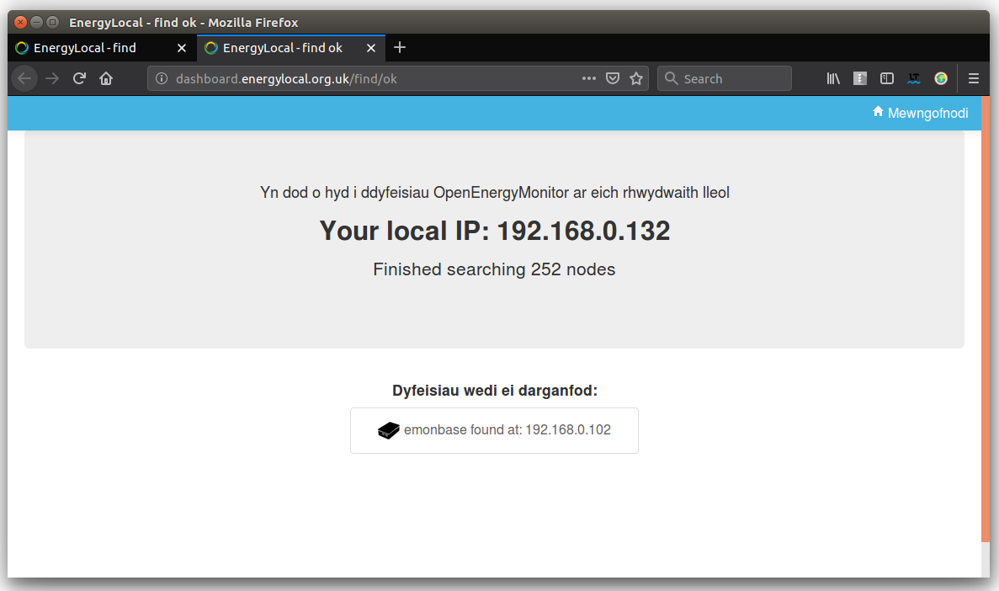

*If the hub does not appear the first time, try refreshing the page a couple of times.*

Click on the hub (listed as emonbase) to open it in your browser. You will now be greeted with the EnergyLocal Hub dashboard page.

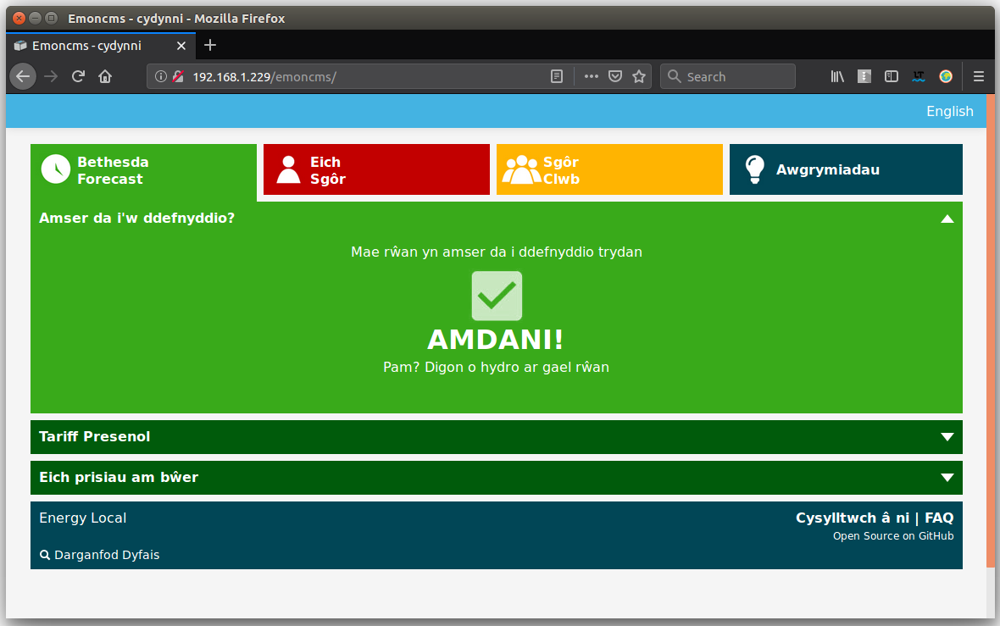
