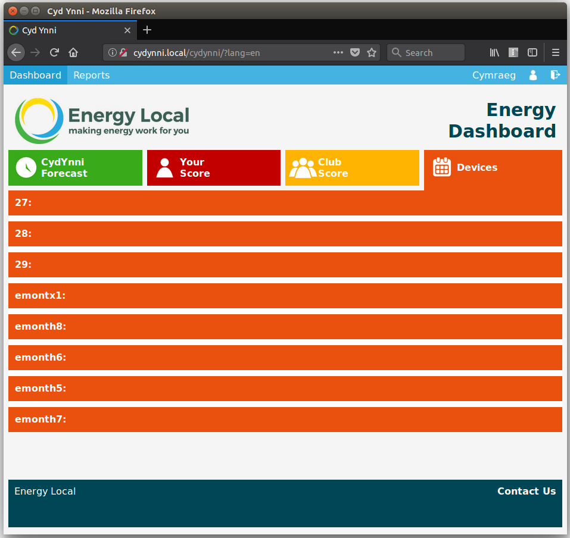
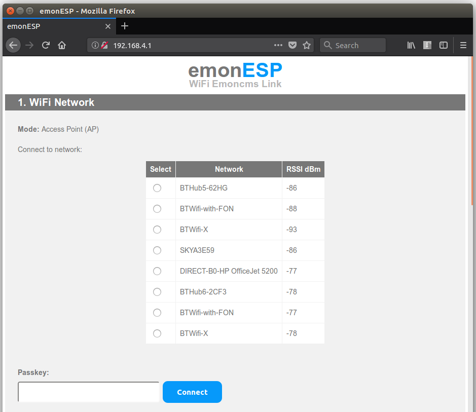
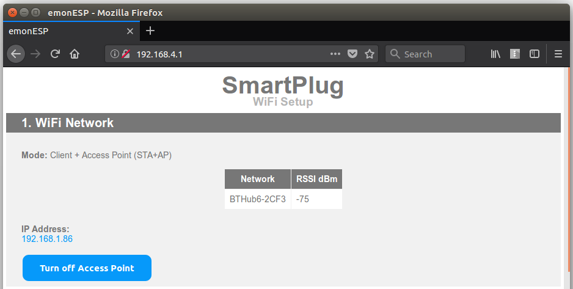
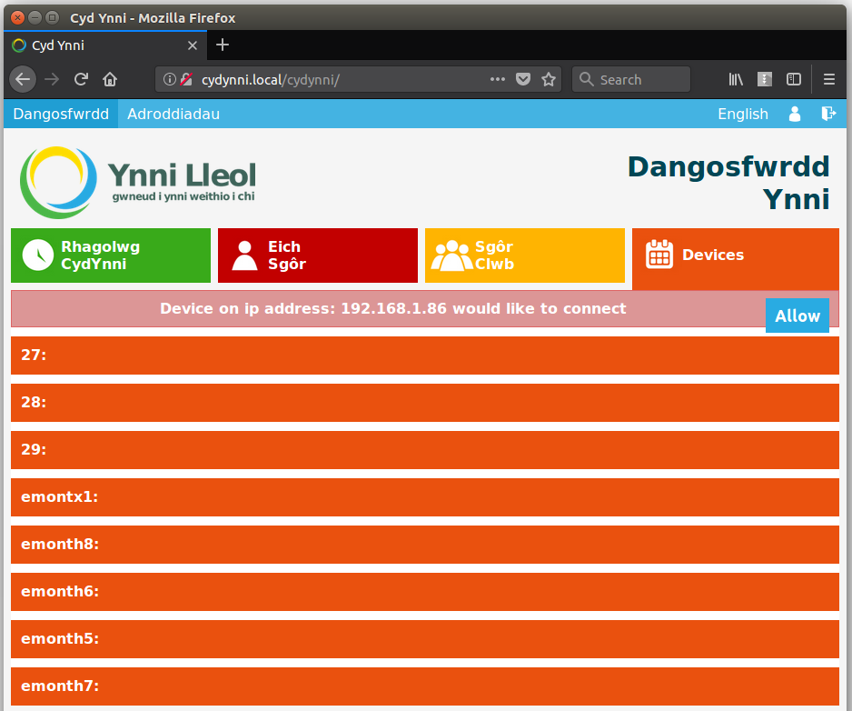
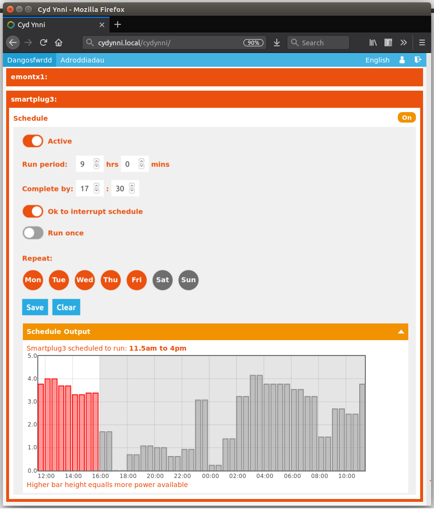

## Setup Guide

### 1. Power up the CydYnni hub

After a short while a WIFI Access Point should appear called 'EmonPi'. Connect to this network, open an internet browser and enter the following address:

    http://192.168.42.1

### 2. Connect to WIFI network

Once the page at the address above loads it will give the following options, or if the hub is connected with an ethernet cable there will also be the option to connect over ethernet.

Select 'Connect to WIFI network' to connect to your home WIFI network.
    

The hub will now show a list of available WIFI networks, select the WIFI network you wish to connect to:

Enter the WIFI network passkey if applicable:

After clicking connect the following message is shown. Your hub is now rebooting and will then attempt to connect to the network selected.

### 3. Login with CydYnni Account

After a couple of minutes, connect back to your home WIFI network and navigate to cydynni hub address:

    http://cydynni.local/
    
or:

    http://cydynni/
    
You will now be greated with the CydYnni hub login page. Enter your CydYnni username and password.

### 4. Explore your hub dashboard

The first page presents the CydYnni forecast showing when its a good time to use electricity or not and the recent history of club consumption and generator output.

The second page shows your score, which relates to how well your managing to match your use to local electricity and cheap times for extra electricity.

The 3rd page shows the club score and overview.

The 4rth tab shows a list of devices.

### 5. WIFI Relay Setup

Install and power up the WIFI Relay.

After a short while a WIFI Access Point should appear called 'emonESP_xxxxxx'. Connect to this network, open an internet browser and enter the following address:

    http://192.168.4.1
    

Select the WIFI network you wish to connect to, enter the passkey and click connect. After 20-30s the interface will show that the module has connected and its IP address:

Connect back to you home network and navigate to the devices page, after a couple of minutes a notice will appear asking whether to allow device at the given ip  address to connect:

Click allow and wait another minute for the wifirelay device to appear. 

Clicking on the wifirelay device will bring up the scheduler interface:

