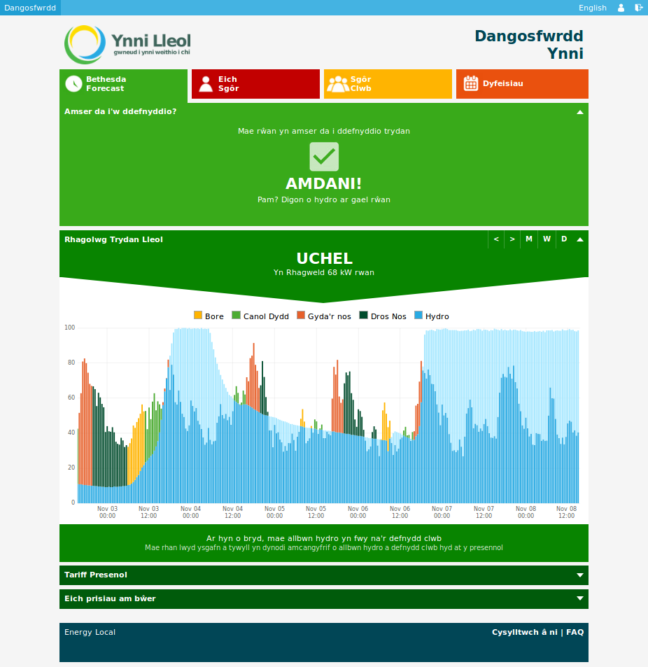

# CydYnni Community Energy Hydro App and Hub

Cyd Ynni : Ynni Lleol is a community project linking up households with local community hydro power projects.

## Documentation

- [Blog: Introduction](https://blog.openenergymonitor.org/2017/08/cydynni-energylocal/)
- [System Architecture](docs/architecture.md)

**CydYnni Hub**

- [Hub: Software Installation Guide](docs/hub/installation.md)
- [Hub: CydYnni App User Guide](docs/userguide.md)

**CydYnni App**

- [Web App: Software Installation Guide](docs/web/installation.md)
- [Web App: API Documentation](docs/web/api.md)

## CydYnni App [https://dashboard.energylocal.org.uk](https://dashboard.energylocal.org.uk)

The CydYnni app is a mobile friendly web app also packaged as an android and iOS app that shows when it is a good time to use electricity in the CydYnni project.

### Licence

This software is available under the GNU Affero General Public Licence see Licence and Copyright files.
