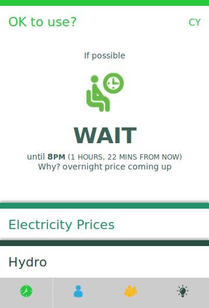
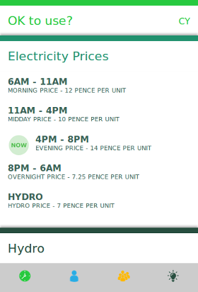
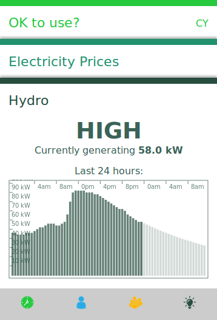
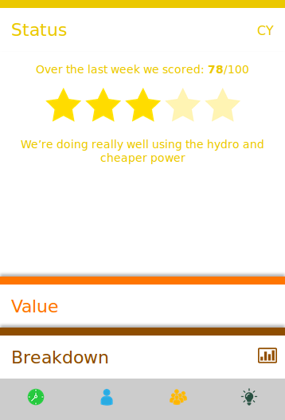
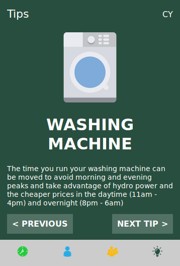

### Cyd Ynni Community Energy Hydro web app

Cyd Ynni : Ynni Lleol is a community project linking up households with local community hydro power projects.

The CydYnni app is a mobile friendly web app also packaged as an android and iOS app that shows when it is a good time to use electricity in the CydYnni project.

### Licence

This software is available under the GNU Affero General Public Licence see Licence and Copyright files.
